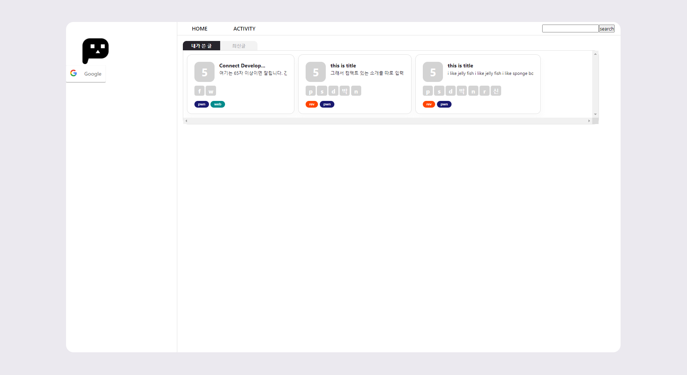
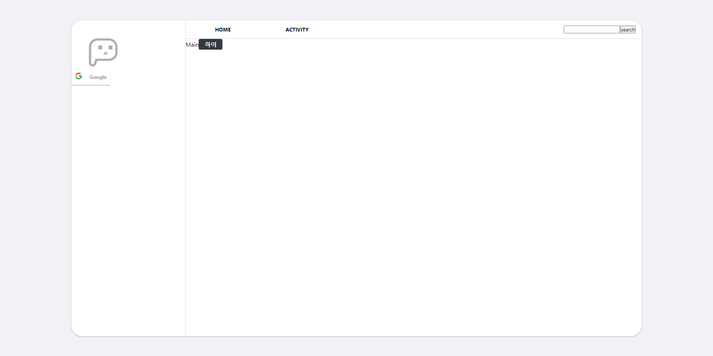

# 간단 메모

- 최근 날짜가 위쪽
- 개발할 때 빼고 서버가 꺼져있음
  - (/home/leebon/connect-frontend로 이동 후 yarn start)

## 2021/08

### 20

### 18

- 최신글 박스
- miniProfile

### 14

- [x] 내가 쓴 글 , 최신글 박스(_RecentBox_)

  - 스크롤 css 알아볼 것
  - recent box의 부모 태그들이 모두 %나 vw로 가로가 지정되어 있어서 그런가 예기치 못한 오버프로우 발생. 임시방편으로 recent box에도 vw를 사용해 그럴듯하게 만들었으나 적절한 보수가 필요함.

- card관련 부분을 scss로 바꿀 필요가 있을 것 같다.



그냥 scss파일들은 모두 styles폴더에 넣기로 함

### 12

- [ ] UI틀 만들기

  - [x] 제일 바깥 container
  - [ ] 카드 적절히 정렬
  - 백엔드와 연동은 틀을 만든 후 차차 진행

- 폴더를 어떻게 정리해아할지 막막함

- 

🎵 알렉 벤자민, 할시

### 11

- [x] 공부삼아 DropdownMenu 컴포넌트 생성. nav용으로 사용 예정..

  - 사용법

```
props: menuName=표시이름, menuLink=메뉴에서 연결할 path
children: <li><Link to=path>Link name</Link></li> 형식으로 사용
```

- node-sass를 설치했으나 cra(create react-app)으로 만든 프로젝트에서는 v6을 사용하지 못한다고 해 v4로 설치. 지금까지 잘 사용했는데 갑자기 이런다.
- css파일을 분리해 사용하는 것이 익숙해서 그런가 styled-component가 상당히 불편하다. 나중에 styled-component를 scss로 바꾸는 과정이 필요할 것 같음.
- utils.scss를 사용하지 않는 scss파일은 그냥 컴포넌트와 같은 폴더에 놓기로 했음. 유지보수가 힘들 것 같기도 하다.
